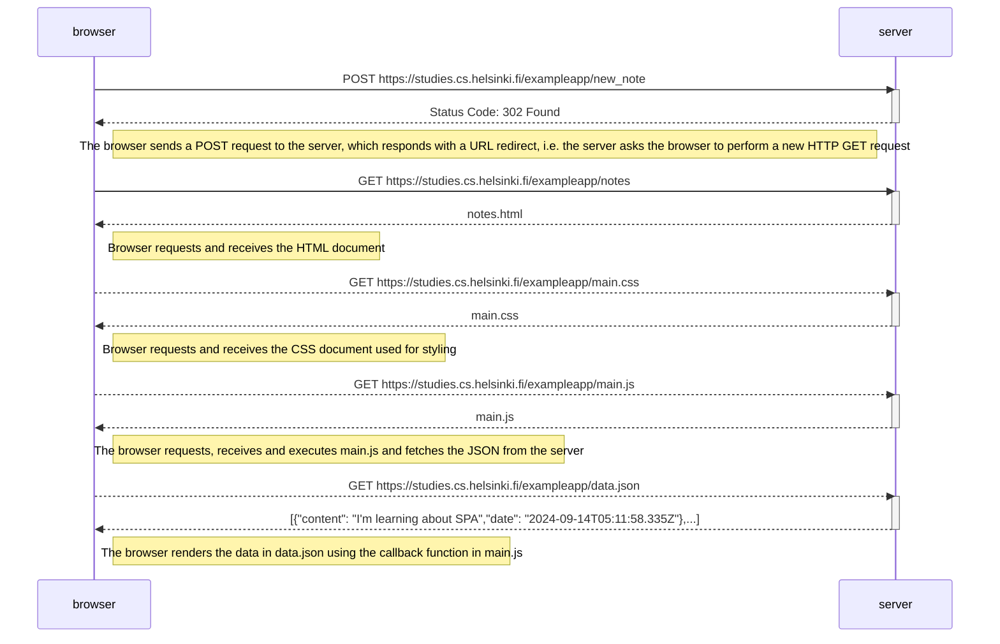

```mermaid
sequenceDiagram
  participant browser
  participant server

  browser->>server: POST https://studies.cs.helsinki.fi/exampleapp/new_note
    activate server
    server-->>browser: Status Code: 302 Found
    deactivate server

    Note right of browser: The browser sends a POST request to the server, which responds with a URL redirect, i.e. the server asks the browser to perform a new HTTP GET request

  browser->>server: GET https://studies.cs.helsinki.fi/exampleapp/notes
    activate server
    server-->>browser: notes.html
    deactivate server

  Note right of browser: Browser requests and receives the HTML document

  browser-->>server: GET https://studies.cs.helsinki.fi/exampleapp/main.css
    activate server
    server-->>browser: main.css
    deactivate server
  
    Note right of browser: Browser requests and receives the CSS document used for styling

  browser-->>server: GET https://studies.cs.helsinki.fi/exampleapp/main.js
    activate server
    server-->>browser: main.js
    deactivate server

    Note right of browser: The browser requests, receives and executes main.js and fetches the JSON from the server

  browser-->>server: GET https://studies.cs.helsinki.fi/exampleapp/data.json
    activate server
    server-->>browser: [{"content": "I'm learning about SPA","date": "2024-09-14T05:11:58.335Z"},...]
    deactivate server

    Note right of browser: The browser renders the data in data.json using the callback function in main.js


```