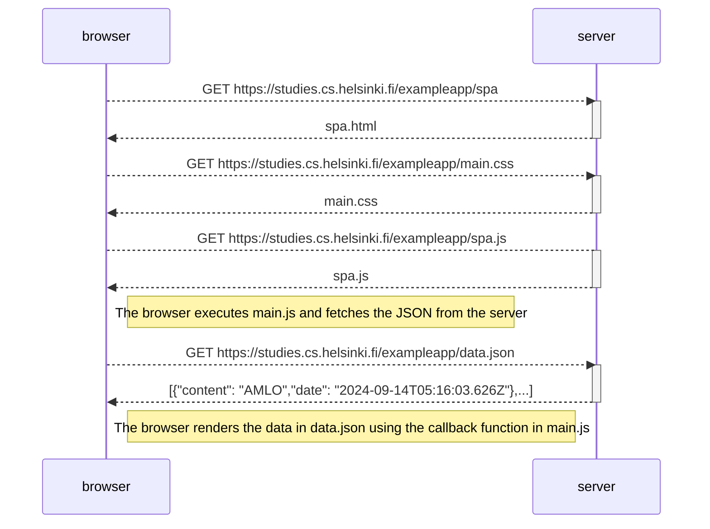

```mermaid
sequenceDiagram
  participant browser
  participant server

  browser-->>server: GET https://studies.cs.helsinki.fi/exampleapp/spa
    activate server
    server-->>browser: spa.html
    deactivate server
  
  browser-->>server: GET https://studies.cs.helsinki.fi/exampleapp/main.css
    activate server
    server-->>browser: main.css
    deactivate server

  browser-->server: GET https://studies.cs.helsinki.fi/exampleapp/spa.js
    activate server
    server-->>browser: spa.js
    deactivate server

  Note right of browser: The browser executes main.js and fetches the JSON from the server

  browser-->>server: GET https://studies.cs.helsinki.fi/exampleapp/data.json
    activate server
    server-->>browser: [{"content": "AMLO","date": "2024-09-14T05:16:03.626Z"},...]
    deactivate server

  Note right of browser: The browser renders the data in data.json using the callback function in main.js 
```